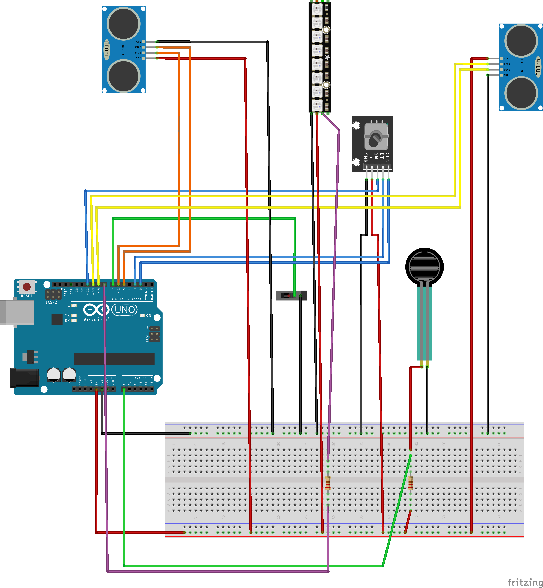

## Concept
Manier un tank avec des controlle "réaliste". le but du jeu est de détruire le tank adverse.
Le focus du projet a été le lien entre capteur et le site

## inspirations

Les inspirations majeures ont été :
Wii Play: Tanks!
https://shakethatbutton.com/spacebattleship-shield/

## mini vidéo et image


## Configuration Matérielle 
requis pour chaque char 

| Marériel  | Quantité | 
| :--- | :--- |
| Capteur Ultrason| 2 | 
| Encodeur rotatif KY-040| 1 | 
| Switch| 1| 
| Led Adafruit neopixel 8| 1| 


### Attribution des Pins

Configuration pour un seul tank


| Composant | Tank 1 (Joueur 1) | Tank 2 (Joueur 2) |
| :--- | :--- | :--- |
| **Ultrason Gauche** | Trig: 10 / Echo: 9 | Trig: 34 / Echo: 35 |
| **Ultrason Droit** | Trig: 6 / Echo: 5 | Trig: 40 / Echo: 41 |
| **Encodeur (CLK / DT)** | 2 / 3 (Interrupts) | 18 / 19 (Interrupts) |
| **Bouton de Tir (SW)** | 11 | 23 |
| **Switch Direction** | 7 | 29 |
| **Pression (FSR)** | A0 | A10 |
| **NeoPixel (8 LEDs)** | 8 | 51 |


## Installation & Logiciel

### 1. Arduino
* **Bibliothèques requises** :
    * `Adafruit_NeoPixel`
    * `Arduino_JSON` (Bibliothèque officielle Arduino)
    

### 2. WebApp (p5.js)
1.  Installez et lancez [p5.serialcontrol](https://github.com/p5-serial/p5.serialcontrol/releases).
2.  Ouvrez votre navigateur sur la page du projet.
3.  Sélectionnez le port série correspondant (ex: `COM3` ou `/dev/tty...`).

## Structure des Données (JSON)

Le projet utilise le format JSON pour communiquer :

```json
{
  "tanks": [
    {
      "distG": 10.5,
      "distD": 8.2,
      "pressure": 512,
      "directionSwitch": 1,
      "angleEncoder": 45,
      "shootButton": 0
    },
    {
      "distG": 15.1,
      "distD": 12.3,
      "pressure": 300,
      "directionSwitch": 0,
      "angleEncoder": 90,
      "shootButton": 1
    }
  ]
}
